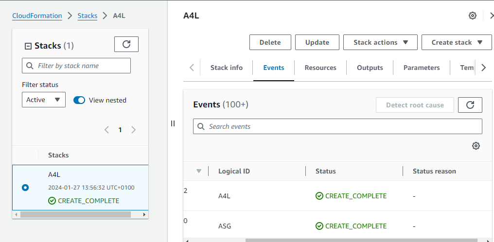

# AWS Client VPN Advanced Demo

This GitHub project provides a comprehensive guide for configuring a secure client VPN deployment, enabling workstations to connect to an AWS Virtual Private Cloud (VPC) in a secure manner.

## Overview

The demo is structured into six stages, each progressively implementing additional components of the architecture:

1. **Stage 1 - Create Directory Service (Authentication for VPN Users)**
2. **Stage 2 - Certificates**
3. **Stage 3 - Create VPN Endpoint**
4. **Stage 4 - Configure VPN Endpoint & Associations**
5. **Stage 5 - Download, Install, and Test VPN Client**
6. **Stage 6 - Cleanup**

## 1-Click Installs (Important: Execute this first)

Ensure you are logged into AWS and in the `us-east-1` region. Execute the following CloudFormation template for VPC creation:

- [VPC CloudFormation Template](https://console.aws.amazon.com/cloudformation/home?region=us-east-1#/stacks/quickcreate?templateURL=https://techidence.s3.amazonaws.com/aws_projects/A4LVPC.yaml&stackName=A4L)

	

## Instructions

Stages:

- [**Stage 1 - Create Directory Service (Authentication for VPN Users)**](https://github.com/Gbengard/aws-client-vpn/blob/main/stage1.md)
- [**Stage 2 - Certificates**](https://github.com/Gbengard/aws-client-vpn/blob/main/stage2.md)
- [**Stage 3 - Create VPN Endpoint**](https://github.com/Gbengard/aws-client-vpn/blob/main/stage3.md)
- [**Stage 4 - Configure VPN Endpoint & Associations**](https://github.com/Gbengard/aws-client-vpn/blob/main/stage4.md)
- [**Stage 5 - Download, Install, and Test VPN Client**](https://github.com/Gbengard/aws-client-vpn/blob/main/stage5.md)
- [**Stage 6 - Cleanup**](https://github.com/Gbengard/aws-client-vpn/blob/main/stage6.md)
