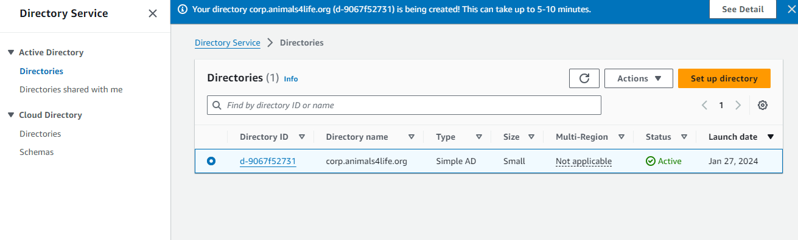

# Advanced AWS Client VPN Demo - Stage 1: Create Directory Service

- **Stage 1 - Create Directory Service (Authentication for VPN Users) <= `YOU ARE HERE`**
- Stage 2 - Certificates
- Stage 3 - Create VPN Endpoint
- Stage 4 - Configure VPN Endpoint & Associations
- Stage 5 - Download, Install, and Test VPN Client
- Stage 6 - Cleanup

## Create a Simple AD Instance

1. Type `Directory Service` into the top search box and open the Directory Services console in a new tab. Alternatively, use [this link](https://console.aws.amazon.com/directoryservicev2/identity?region=us-east-1#!/directories).
2. Click `Set up Directory`.
3. Select `Simple AD` and click `Next`.
4. Choose `Small` (for larger deployments, consider larger sizes or alternative authentication methods).
5. Choose a `Directory DNS Name`; for example, `corp.animals4life.org`.
6. Pick a `Directory NetBIOS name`; for example, `CORP`.
7. Choose an `Administrator password` that meets complexity requirements.
8. Confirm the password in the `Confirm Password` box.
9. Optional: Enter `Directory description - Optional` as `Directory Service for AWS Client VPN Demo`.
10. Click `Next`.
11. Under VPC, select `A4L-VPC` from the dropdown.
12. Under `Subnets`, ideally select `A4L-SN-PRIV-A` and `A4L-SN-PRIV-B`. If not available, choose any two of the PRIV subnets.
13. Click `Next`.
14. Click `Create Directory`.

The directory will start provisioning; it must complete and move into the `Active` state before proceeding to Stage 2.

**END OF STAGE 1**
