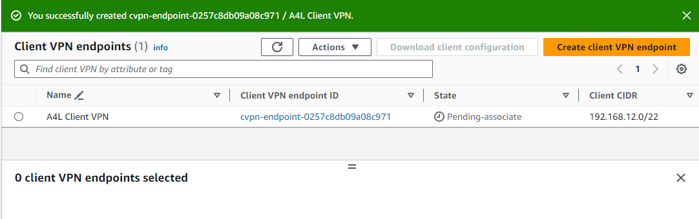

# Advanced AWS Client VPN Demo - Create VPN Endpoint

This GitHub project provides step-by-step instructions for setting up an AWS Client VPN, allowing you to create a secure VPN endpoint. The project is divided into stages, and this section focuses on Stage 3 - Create VPN Endpoint.

## Stages Overview:
- Stage 1 - Create Directory Service (authentication for VPN users)
- Stage 2 - Certificates
- Stage 3 - Create VPN Endpoint <= **YOU ARE HERE**
- Stage 4 - Configure VPN Endpoint & Associations
- Stage 5 - Download, install and test VPN Client
- Stage 6 - Cleanup

**Prerequisites:**
- Ensure the Directory Service created in the previous step is in an `Active` state.
- Make sure you have created and imported the server certificate from Stage 2 before starting Stage 3.

## Create VPN Endpoint:

1. Type 'VPC' in the services search box at the top of the screen, right-click, and open in a new tab.
2. Under Virtual Private Network (VPN) on the left menu, locate and click `Create VPN Endpoint`.
3. Click `Create Client VPN Endpoint`.
4. Enter `A4L Client VPN` for the `Name Tag`.
5. Set `Client IPv4 CIDR*` to `192.168.12.0/22`.
6. Choose the server certificate created in Stage 2 from the `Server certificate ARN*` dropdown.
7. Under `Authentication Options`, check `Use user-based authentication`.
8. Check `Active Directory authentication`.
9. Choose the directory created in Stage 1 under `Directory ID*` (e.g., corp.animals4life.org).
10. Under `Connection Logging`, for `Do you want to log the details on client connections?*`, check `no`.
11. For `DNS Server 1 IP address` and `DNS Server 2 IP address`, enter the IP addresses from the directory service instance. Copy the IPs from the directory service console's DNS address area.
12. Check `Enable split-tunnel`.
13. In the `VPC ID` dropdown, select `A4L-VPC`.
14. Ensure both `Default` SG and `A4L DefaultSG` are checked.
15. Check `Enable self-service portal`.
16. Click `Create Client VPN Endpoint`.

	

The VPN endpoint is now ready for configuration in the next stage of the project.