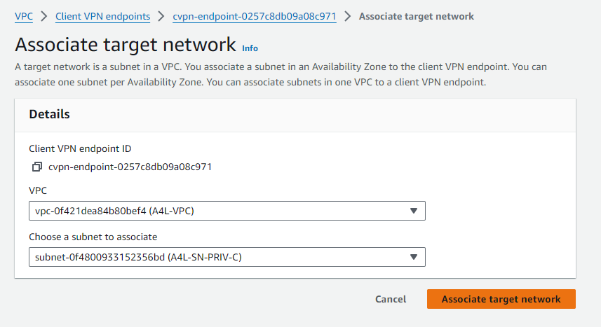

# AWS Client VPN Advanced Demonstration - Configuration of VPN Endpoint & Associations

This GitHub project guides users through the advanced configuration of an AWS Client VPN, emphasizing the setup and association of VPN endpoints. The project is organized into distinct stages as outlined below:

- **Stage 1 - Create Directory Service (authentication for VPN users)**
- **Stage 2 - Certificates**
- **Stage 3 - Create VPN Endpoint**
- **Stage 4 - Configure VPN Endpoint & Associations** <= `YOU ARE HERE`
- **Stage 5 - Download, install and test VPN Client**
- **Stage 6 - Cleanup**

**Pre-requisites:**
- Ensure that the Directory Service created in the previous step is in an `Active` state.
- Create and import the server certificate from Stage 2 before starting Stage 3.
- Verify that the VPN endpoint has been successfully created in the previous stage.

## Stage 4 - Configure VPN Endpoint & Associations

**Association of Client VPN Endpoint:**

1. Navigate to the `Client VPN Endpoints` section in the VPC console.
2. Select the `A4L Client VPN` endpoint.
3. Click on the `Target Network Associations` tab and then click `Associate Target Network`.
4. From the `VPC*` dropdown, select the `A4L-VPC`.
5. Open a new tab and access the VPC Subnets console [here](https://console.aws.amazon.com/vpc/home?region=us-east-1#subnets).
6. Identify the subnet IDs for the three private subnets in the A4L VPC.
7. In the `Choose a subnet to associate*` dropdown, select the first available PRIV subnet from the list (PRIV-A, PRIV-B, PRIV-C).

	

8. Click `Associate`.

Please note that after the association, it is essential to wait for the state of the VPN endpoint to change from `Pending-associate` to `Available`. This ensures that the VPN Endpoint is fully configured and ready for use.