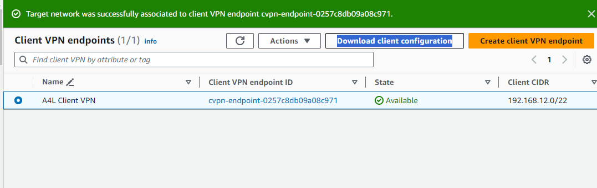
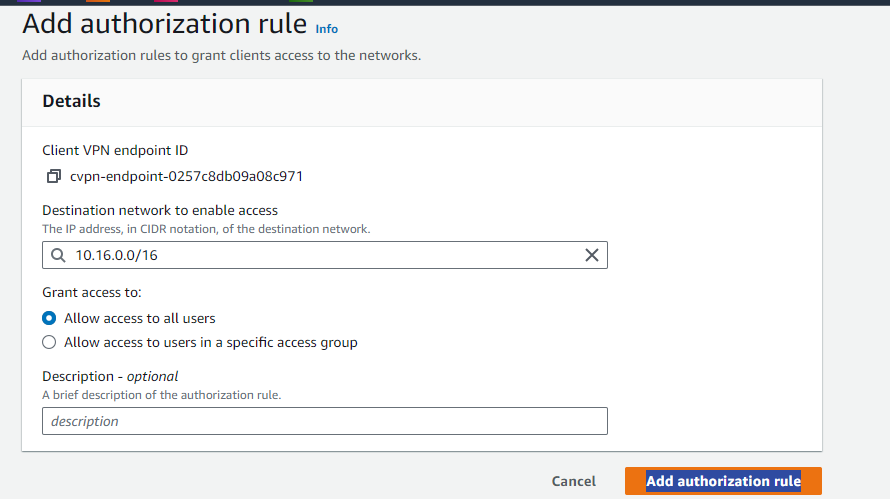

# A4L Client VPN Setup Guide

## Project Stages:

1. **Stage 1 - Create Directory Service (authentication for VPN users)**
2. **Stage 2 - Certificates**
3. **Stage 3 - Create VPN Endpoint**
4. **Stage 4 - Configure VPN Endpoint & Associations**
5. **Stage 5 - Download, Install, and Test VPN Client** <= `YOU ARE HERE`
6. **Stage 6 - Cleanup**

**Important Prerequisites:**
- Ensure the Directory Service created in the previous step is in an `Active` state.
- Create and import the server certificate from Stage 2 before starting Stage 3.
- The VPN endpoint should be created and associated with the A4L VPC in the previous stages.

## Download the ClientVPN Application & Configuration

1. From the `Client VPN Endpoints` area of the VPC console, select the `A4L Client VPN` endpoint.
2. Click `Download Client Configuration`, Click `Download` and save the file.
	
	
	
3. Visit [AWS Client VPN Download Page](https://aws.amazon.com/vpn/client-vpn-download/) and download the client for your operating system.
4. Install the VPN Application.
5. Start the application.
6. Go to manage profiles.
7. Add a profile.
8. Load the profile you downloaded (client configuration) - use `A4L` for Displayname.

## Connect

1. Connect to A4L VPN.
2. Enter `Administrator` as the username and password you chose in Stage 1 for the Directory Service.
3. Once connected, open a terminal and `ping DIRECTORY_SERVICE_IP_ADDRESS` (you can get this from the DS Console).

Notice it doesn't work? One more step, and that's authorizations.

## Authorize

1. From the [Client VPN Console](https://console.aws.amazon.com/vpc/home?region=us-east-1#ClientVPNEndpoints:sort=status.code), select the A4L VPN Endpoint.
2. Click the `Authorization` tab and click `Authorize Ingress`.
3. For `Destination network to enable`, enter `10.16.0.0/16`.
4. For `Grant access to`, check `Allow access to all users`.

	

5. Click `Add Authorization Rule`.
6. Open a terminal and `ping DIRECTORY_SERVICE_IP_ADDRESS` (you can get this from the DS Console).
7. Notice how this works? You are now connected.
8. Browse to the Private IP Address of `CATWEB` instance using `http` (not https) – this also should work.
